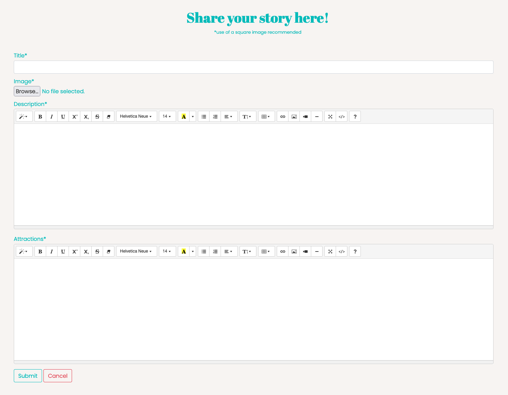
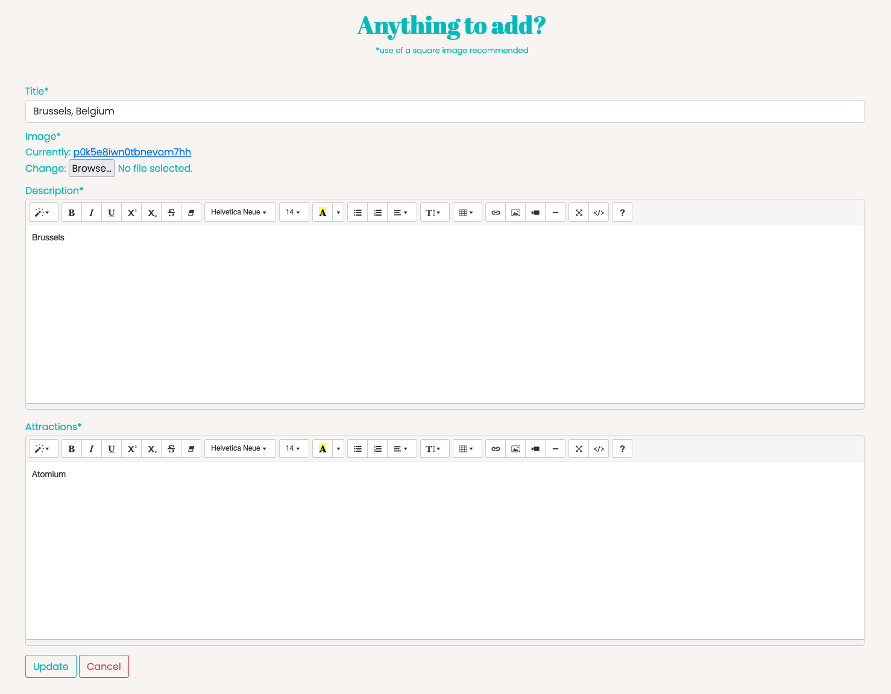
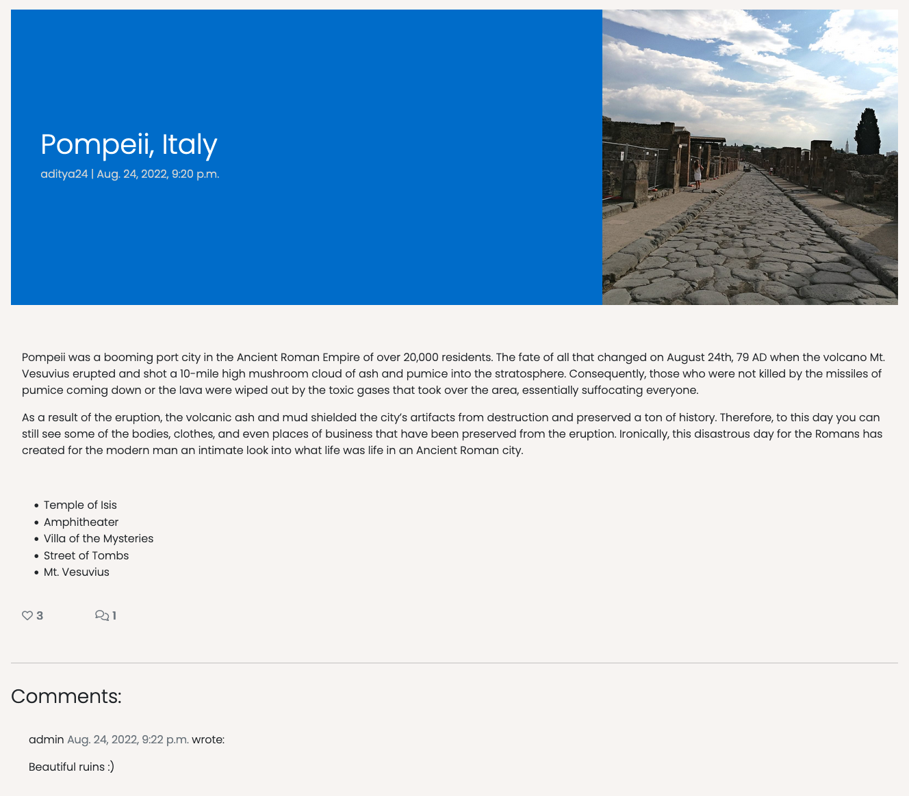

Welcome to TravelGramers!

Traveling is a wonderful experience. It is one of the best ways to forget the hustle and bustle of a stress-filled life in the city. Through travels, you can discover not only new places, but also new cultures, cuisines, and ways of life. You experience lots of new things by visiting places you have never been to, and you may create new bonds with people you have never met before. Each of this moment is a memory waiting to be told. 

TravelGramers is a blog created for one purpose: for travel enthusiasts to tell their tales. You can share your most unique and interesting travel stories with others. After creating your blog account, you will be able to create a blog post and share your travel experience. Oh, and don't forget to include your best photo!

The creation of this blog is intended to showcase a Full-Stack web application in a real-world context using an MVC framework and related technologies. Heroku is used to deploy the application on a webpage.

[Visit TravelGramers Blog](https://travelgramers-blog.herokuapp.com/)

## Table of Content

## Objective

TravelGramers is a travel blog that is targeted to a specific audience: those who share the love of travel, regardless of demographics. The blog displays a paginated list of blog posts belonging to various different users. Each post can be viewed and interacted with. Users can create an account to be able to create a new post on the blog. Logging in is not necessary to view the available posts on the blog, although logged-in users can click the like button on each post as well as leave comments to interact with one another. They will also be able to update their post(s) to add more information, or they can choose to delete them entirely should they feel like doing so.

## User Experience

### Agile Methodology

As part of the requirements to start this project, an Agile Methodology was used in order to draft and develop the website. This approach played an important part during the planning phase as I managed to break down the project into smaller tasks.

[Github Projects](https://github.com/users/Lapratomo24/projects/6/views/1) was used to set up a Kanban Board. Please see the attached screenshots below for the completed rundown of the phases.

<b>Phase 1</b>

 

<b>Phase 2</b>

 

<b>Phase 3</b>

 

<b>Phase 4</b>

 

<b>Phase 5</b>

 

There are 14 issues, or in other words, User Stories that were planned and documented as the project was being developed in order to achieve the desired result. These issues were then further classified as 4 main Epics as follows.

### User Stories

**Epic - Site Administration**
- As a site administrator, I would like to be able to create, read, update, and delete posts from the admin page so that I can manage the blog's content.

**Epic - Site Navigation**
- As a user, I would like to be able to immediately understand the purpose of the website so that I can use it to the full extent.
- As a user, I would like to be able to navigate through the pages of the website with ease so that I can keep track of where I am.
- As a user, I would like to be able to see a paginated list of posts so that I can select which post I would like to view.
- As a user, I would like to be able to view each post in detail so that I can read the post's content in detail.
- As a user, I would like to be able to see the number of likes on each post without having to view it in detail.
- As a user, I would like to be able to click the social media buttons so that I can interact with the creator of the website.
- As a user, I would like to be able to see each post's date and time of creation so that I can find out when the post was published.
- As a user, I would like to be able to see if an error occurs so that I can address it.
- As a user, I would like to be able to get a notification so that I can tell whether my registration, login, and logout attempts are successful.

**Epic - User Profile**
- As a user, I would like to be able to register a blog account so that I can have my own blog account.
- As a user, I would like to be able to log in so that I can fully interact with the website.
- As a user, I would like to be able to see my post-login status immediately so that can know my login is successful.
- As a user, I would like to be able to log out so that I can prevent another user from using my account.

**Epic - Post Management**
- As a user, I would like to be able to create a post so that I can share my travel experience on the website.
- As a user, I would like to be able to edit/update my own post(s) so that I can always add more information to it.
- As a user, I would like to be able to delete my own post(s) so that I can be fully in control as a post author.
- As a user, I would like to be able to log in so that I would be able to edit/update or delete my post(s).
- As a user, I would like to be able to leave and remove a like so that I can interact with the posts belonging to other users.
- As a user, I would like to be able to leave a comment (or more) so that I can interact with the posts belonging to other users.

## Design

As stated previously, this blog website follows the same initial setup as the tutorial. The design of the homepage, as well as subsequent pages, may look similar to the finished website shown in the tutorial, albeit adjusted with my own design. 

### Data Model

Due to strict time constraints, I decided to develop a blog website which follows the same initial setup as Matt Rudge's Django Blog Tutorial, therefore there are only 2 data models: Post and Comment. And for the sake of simplicity, 2 things are adjusted: The status of a new post is automatically set to published, and comments made by users will also be automatically approved and displayed on the comment section. The database model is as follows:

### Logo

I created the TravelGramers logo, seen at the top of this readme file, on [Canva](https://www.canva.com/), which has always been my go-to design tool for many years.

### Wireframes

Similary, Canva was also used to create the wireframes for TravelGramers. The following are the wireframes for each page on the finished website.

<b>Homepage (not logged in)</b>

 

<b>Homepage (logged in)</b>

 

<b>Create Page</b>

 

<b>Post Detail Page (not logged in)</b>

 

<b>Post Detail Page (logged in)</b>

 

<b>Update Page</b>

 

<b>Delete Page</b>

 

<b>About Page</b>

 

<b>Signup Page</b>

 

<b>Login Page</b>

 

<b>Logout Page</b>

 

### Color Scheme

The color scheme was derived from [ColorSpace](https://mycolor.space/). I use a predominantly white ash color for the background of the body as well as the navigation bar, blue-ish green for the post title, buttons, and page headers, as well as blue for the footer.

### Font Style

The main font families used for the design of this project are [Poppins](https://fonts.google.com/specimen/Poppins?query=poppin) and [Abril Fatface](https://fonts.google.com/specimen/Abril+Fatface?query=abril) from Google Fonts.

### Images

All of the images displayed on the posts, as well as the hero image, belong to me. I am a travel enthusiast myself, hence why I decided to create this travel blog website. I fully guarantee that you will not find the exact same images online.

## Structure and Features

TravelGramers consists of multiple pages, albeit the structure is quite simple to navigate. It is compatible on all major browsers and fully responsive across all screen sizes. Every page is described in detail below which includes the available features.

### Homepage

The homepage is where users will find a paginated list of blog posts. The posts are preceded by a navigation bar at the top of the screen and followed by a footer section down at the bottom, both of which are visible across all pages.

The navigation bar consists of a TravelGramers logo on the left and 4 navigation items on the right which include home, about, log in, and sign up. The latter 2 are replaced by create and log out whenever a user logs in with their account. Between the navigation bar and the posts, a hero image is displayed with an overlay of a big TravelGramers logo. Once logged in, users will see a welcome message which displays their username underneath the logo. 

Just below the hero image, a tagline that says "Share your unique travel experience" invites users to create a post on the blog. Once logged in, users will see a call-to-action button underneath the tagline which redirects to the create page. The first set of 3 posts then follows, each of which is represented with an image, author's name, title, exact date and time of publishing, and the number of likes for the post.

<b>Tagline and 1st Set of Posts</b>

 

Below the second set of 3 posts is a next button which indicates that the page is paginated by 6 posts per page.

<b>2nd Set of Posts and Next Button</b>

 

The footer includes a copyright text and 2 social media icons which when clicked will redirect users to the blog author's Instagram and LinkedIn pages, respectively.

<b>Footer</b>

 

### About Page

The about page informs users of what TravelGramers is about. It describes the significance of traveling and invites users to tell their travel stories. A link to the create page can be found within the last sentence of the page.

### Login, Logout, and Signup Pages

The purpose of these respective pages is self-explanatory. The description of each layout is as follows:

- The login page consists of a welcome back message, as well as the username and password fields for users to fill their credentials in. The login button follows just below the fields. A link to the signup page is also visible if users haven't actually created an account yet.

<b>Login</b>

 

- The logout page only consists of a come back soon message and a logout button.

<b>Logout</b>

 

- The signup page consists of a join us message at the top. It is followed by a link to the login page in case a user forgets that they already have an account of their own. Underneath it 4 fields are visible: username, optional email, password, and password (again) fields, respectively. The signup button is seen at the bottom.

<b>Signup</b>

 

### Create, Update, and Delete Pages

These 3 pages represent the 3 out of 4 basic operations of programming: Create, Update, and Delete. The description of each layout is as follows:

- The create page utilizes Summernote for 2 of the available fields for users to fill out. The page header can be seen at the top of the page, under which the recommended use of a square image is stated. The first field is the title field, which is followed by the django-provided browse button for users to upload an image. Then then afore-mentioned Summernote widgets are displayed in the form of, well, forms. The first form asks user to fill out the description of their travel experience, and the second asks for the main attractions users visited whilst traveling. At the bottom of the page, the submit and cancel buttons can be seen.

- The update page is essentially an exact copy of the create page. Since the theme here is update, the title field and forms will have been pre-filled beforehand when a user created the initial post, as they can not be empty. The page header asks whether there is anything to update and the submit button from the create page is replaced with an update button.

<b>Update</b>

 

- The delete page is self-explanatory. It asks whether the user is sure that they would like to delete the post entirely due to the fact that it can not be undone. The delete and cancel buttons follow underneath.

<b>Delete</b>

 

### Post Detail Page

The post detail page represents the view operation of programming. Here is where users can view their own post(s) as well as posts created by other users. The section at the top displays the title of the post, which is the travel location, and the exact date and time when the post was published. To the right is the exact same picture for the post that is initially visible on the homepage. Below this section, the description of the post can be seen, then followed by the attractions of the post location, which in this case is in the form of a unordered list. Underneath the bullet points are the number of likes and comments left by other users who viewed this particular post. 

Users who do not log in will not be able to interact with the like button, nor will they be able to see the comment form on the right side of the page. Moreover, the update and delete buttons will not be displayed to the author of a post if they do not log in beforehand. The following screenshot shows the version of the same page after logging in:

<b>Post Detail (logged in)</b>

 

At the bottom of the page is where the comment section is displayed. To be more specific, unless viewed on smaller screens, comments are displayed on the left while the comment form for users to leave their comment(s) is displayed on the right. The submit button is displayed below the form.

<b>Comment Section</b>

 

### Future Features

- As the website grows with many different users visiting and publishing their travel stories, it would be nice to add a profile page that displays not only information about the user but also a list of posts that they created.
- Similarly, a search bar and button would be a nice addition on the navbar so that users can quickly search for a particular post.
- Add update and delete functionalities for comments to complete the CRUD operations on the comment section.
- Add social media sign up and login features.

## Testing

### Manual Testing

As a site administrator, I confirm to be able to use the CRUD operations so that I can fully manage TravelGrames blog website.

**Site Navigation**

| Feature | Action | Expected Outcome | Result |
| - | - | - | - |
| Homepage |
| Not logged in state |
| Home nav item | Click | Redirects to homepage | PASS |
| Home nav item | Click | Redirects to homepage | PASS |
| About nav item | Click | Redirects to about page | PASS |
| Home nav item | Click | Redirects to homepage | PASS |
| Login nav item | Click | Redirects to login page | PASS |
| Signup nav item | Click | Redirects to signup page | PASS |
| Logged in state |
| Create nav item | Display | Replaces login button | PASS |
| Create nav item | Click | Redirects to create page | PASS |
| Logout nav item | Display | Replaces signup button | PASS |
| Logout nav item | Click | Redirects to homepage | PASS |
| Tell your story button | Display | Displayed after logging in | PASS |
| Tell your story button | Click | Redirects to create page | PASS |
| Regular state |
| Image Card | Click | Redirects to post detail page | PASS |
| Post author | Click | Redirects to post detail page | PASS |
| Instagram icon | Click | Redirects to instagram website | PASS |
| LinkedIn icon | Click | Redirects to linkedin website | PASS |
| About page |
| Not logged in state |
| HERE link | Click | Redirects to login page | PASS |
| Logged in state |
| HERE link | Click | Redirects to create page | PASS |
| Signup page |
| Username field | Empty | Prompts user to fill out | PASS |
| Password field | Empty | Prompts user to fill out | PASS |
| Password field | Fewer than 8 chars | Prompts user to provide at least 8 chars | PASS |
| Email field | Empty | Does not prompt user to fill out as it is optional | PASS |
| Sign up button | Click | Redirects to homepage | PASS |
| Sign up button | Display | Display successful signup message after getting to homepage | PASS |
| Login page |
| Username field | Empty | Prompts user to fill out | PASS |
| Password field | Empty | Prompts user to fill out | PASS |
| Remember me checkbox | Unclicked | Does not prompt user to click as it is optional | PASS |
| Log in button | Click | Redirects to homepage | PASS |
| HERE link | Click | Redirects to signup page | PASS |
| Log in button | Display | Display successful login message after getting to homepage | PASS |
| Logout page |
| Log out button | Click | Redirects to homepage | PASS |
| Log out button | Display | Display successful logout message after getting to homepage | PASS |
| Post detail page |
| Not logged in state |
| Update button | Display | Not displayed | PASS |
| Delete button | Display | Not displayed | PASS |
| Like icon | Click | Unclickable | PASS |
| Comment form | Display | Not displayed | PASS |
| Comment section | Display | Displayed under icons | PASS |
| Logged in state |
| Update button | Display | Displayed under header | PASS |
| Delete button | Display | Displayed under header  | PASS |
| Like icon | Click | Clickable | PASS |
| Comment form | Display | Displayed | PASS |
| Comment form | Empty | Prompts user to fill out when clicking submit button | PASS |
| Submit button | Click | Submits comment when filled out | PASS |
| Submit button | Click | Displays successful message after clicking | PASS |
| Comment section | Display | Displays new comment under other comment(s) | PASS |
| Create and Update pages |
| Title field | Empty | Prompts user to fill out | PASS |
| Image browse button | Unclicked | Does not prompt user to select an image as a placeholder will be displayed | PASS |
| Description field | Empty | Prompts user to fill out | PASS |
| Attractions field | Empty | Prompts user to fill out | PASS |
| Submit button | Click | Submits post when filled out | PASS |
| Submit button | Click | Displays successful message after getting to homepage | PASS |
| Cancel button | Click | Redirects to homepage | PASS |
| Update button | Click | Submits post when filled out | PASS |
| Update button | Click | Displays successful message after getting to homepage | PASS |
| Delete button | Click | Redirects to homepage | PASS |
| Delete page |
| Delete button | Click | Deletes post and redirects to homepage | PASS |
| Cancel button | Click | Redirects to post detail page | PASS |

**Site Navigation: Mobile View**

| Feature | Action | Expected Outcome | Result |
| - | - | - | - |
| Bars | Display | Displayed when in mobile view or when resizing to a smaller screen | PASS |
| Bars | Click | Toggles a dropdown menu consisting of 4 navigation items | PASS |
| All pages | Display | Shows full responsiveness | PASS |

### Automated Testing

Due to my limited knowledge combined with strict time constraints, I was only able to implement few automated testing test procedures as follows: 

## Code Validation

TravelGramers has been validated through W3C Validator for both HTML and CSS. The single JavaScript code on the base.html has also been checked with JSHint for its validity. Moreover, PEP8 was used to test the validity of python code.

### HTML

All pages passed the validation test with the exception of errors that are caused by images that are uploaded and published as part of a user's post as detailed in the screenshot below. I believe these are errors that can be ignored, as otherwise I am not certain where in the code they can be fixed. Please provide clarity during assessment if possible, thank you.

### CSS

CSS code passed the validation test with flying colors.

### JavaScript

The single JavaScript code passed the validation test as expected.

### Python

Aside from some 'line too long' errors in settings.py as seen in the below example, Python code passed the validation test.

### Lighthouse

Lighthouse validation was run across all pages of the website in order to check performance, accessibility, best practices, and SEO. The 'small' pages with minimum content passed with flying colors, though admittedly the pages with the most content do not have the best results. And due to time constraints, I am not able to improve the scores as desired at least until I receive the grade, after which I plan to revisit the project and try implement some updates.

## Bugs

- The hero image implements a parallax effect on the homepage. The parallax itself is responsive, while the image depicting Florence, Italy is not. I tried googling the solution and found this [site](https://inkplant.com/code/responsive-parallax-images). As instructed, I tried implementing some JQuery code and tinkered with the code for a long while. Due to my limited knowledge, I am still not able to implement proper responsiveness to the image. What I did in the end was edit the image in a such a way that it gives off the impression of being responsiive. The JQuery is still visible on base.html while being commented out.

- The positioning of both the header and image on the post detail page was quite frustrating to fix due to my limited knowledge on bootstrap column and grid systems. The initial setup as how it looks on the Django Blog Tutorial was not the best when using square images, so I decided to tinker with it until I managed to produce the final layout. 

## Technologies

### Languages

- Python
- HTML
- CSS
- JavaScript

### Frameworks, modules, libraries

- [Django](https://www.djangoproject.com/): Python web framework that encourages rapid development for this project.
- [Django-allauth](https://django-allauth.readthedocs.io/en/latest/installation.html): Authentication library.
- [Bootstrap5](https://getbootstrap.com/docs/5.2/getting-started/introduction/): The most popular HTML, CSS, and JavaScript framework for creating responsive, mobile-first websites.
- [os](https://docs.python.org/3/library/os.html): Module that provides a portable way of operating system dependent functionality.
- [dj-database-url](https://pypi.org/project/dj-database-url/): Allows the use of DATABASE_URL environment variable to configure Django application.
- [Summernote](https://summernote.org/): JavaScript library that helps create WYSIWYG editors online.
- [Crispy](https://django-crispy-forms.readthedocs.io/en/latest/): Application that helps to manage Django forms.
- [Gunicorn](https://gunicorn.org/): Python WSGI HTTP Server.
- [psycopg2](https://pypi.org/project/psycopg2/): PostgreSQL database adapter for Python.

### Programs

- [PostgreSQL](https://www.postgresql.org/): Open source object-relational database system.
- [Heroku](https://www.heroku.com/): Cloud platform used for the project deployment that lets companies build, deliver, monitor and scale apps.
- [GitHub](https://github.com/): Code hosting platform for version control and collaboration.
- [Gitpod](https://www.gitpod.io/): An IDE to create and develop this project.
- [Cloudinary](https://cloudinary.com): End-to-end image and video hosting solution for websites and mobile apps.
- [Canva](https://www.canva.com/): Online graphic design tool to create wireframes, logo, and edit all my travel images/photos.
- [Google Fonts](https://fonts.google.com/): Font generator.
- [ColorSpace](https://mycolor.space/): Color palette generator.
- [Font Awesome](https://fontawesome.com/): Icon library and toolkit.
- [Firefox DevTools](https://firefox-dev.tools/): A set of tools for inspecting and editing web code, as I prefer to use Firefox instead of Chrome.
- [Unsplash](https://unsplash.com/s/photos/travel?orientation=squarish): For the placeholder image.

## Deployment

For this fourth milestone project, Heroku is used for the deployment of the application as opposed to GitHub.

1. After logging in, click the New button on the top right.
2. From the dropdown, click Create new app.
3. Type in a relevant name, choose your region, thne click Create app button.
5. Go to Resources tab, and type in Postgres under add-ons to select Heroku Postgres.
6. Go to Settings tab and click Config Vars button, then add the following:
- CLOUDINARY_URL : cloudinary key,
- DATABASE_URL : postgres database url,
- SECRET_KEY = self-explanatory,
- PORT : 8000,
- DISABLE_COLLECTSTATIC = 1 (to be removed in final deployment)
7. Before deployment, make sure to set DEBUG to False.
8. Then add X_Frame_Options = 'SAMEORIGIN' so the summernote editor can be loaded.
7. Now go to Deploy tab and choose GitHub as your Deployment method.
8. Connect to GitHub by clicking the Search button and choosing the correct repository.
9. You can now choose between Enable Automatic Deploys or manually deploy the application via Deploy Branch. After Heroku finishes building the application, you can click the View button to launch and run your terminal on a new tab.

**GitHub**

Forking the Repository

- Locate the repository.
- Locate the 'Fork' button on the right side of the page. Clicking the button results in the creation of a copy of the repository.
- The copy is now found in your GitHub account.

Cloning the Repository

- Locate the repository.
- Click the 'Code' button to the left of the green 'Gitpod' button.
- Copy the link under HTTPS by clicking the clipboard icon.
- Open Git Bash.
- Change the current working directory to the location where you want the cloned directory to be made.
- Type git clone and then paste the copied link form GitHub.
- Pressing 'Enter' will result in the creation of the local clone.

## Credits

### Code

- [Django Views](https://docs.djangoproject.com/en/4.1/topics/http/views/)
- [Breaking long lines](https://doingmathwithpython.github.io/breaking-long-lines-in-python.html)
- [CSS Box Shadow](https://getcssscan.com/css-box-shadow-examples)
- [Glow effect for social media icons](https://codepen.io/dig-lopes/pen/WLVGda)
- [Best font pairings](https://heyreliable.com/ultimate-google-font-pairings/)
- [Shadow effect for welcome message](https://designshack.net/articles/css/12-fun-css-text-shadows-you-can-copy-and-paste/)
- [Responsive parallax tutorial](https://inkplant.com/code/responsive-parallax-images)
- [Summernote config](https://github.com/summernote/django-summernote#options)
- [Use of block title](https://zappycode.com/tutorials/default-and-specific-titles-using-django-blocks)
- [Travel blog for layout and content reference](https://artoftravel.tips/)

### Acknowledgements

I can't stress this enough but I am really grateful for Matt Rudge's Django Blog Tutorial as otherwise I would have been lost in this project due to my limited knowledge (still even now) in django as well as strict time constraints as I spent a month back in my home country Indonesia and 'sacrifice' much of my time to study to spend quality vacation time with family and friends.

And of course, this would also not have been possible if not for the guidance, instructions, and recommendations I received from my mentor [Akshat Garg](https://www.linkedin.com/in/akshatnitd/).

And lastly, I am grateful to the Slack Community for the helpful solutions provided whenever I was stuck.

---

Looking forward to my specialization module and project with React!
